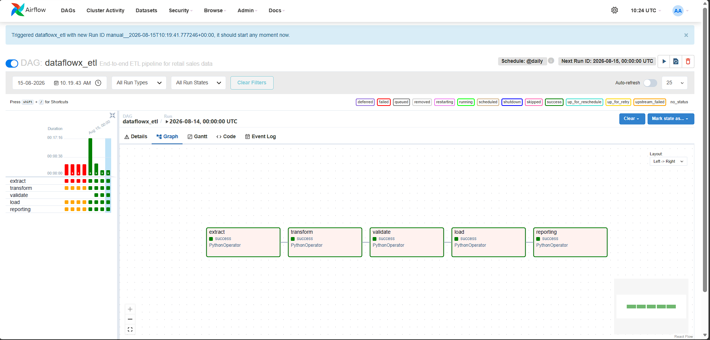
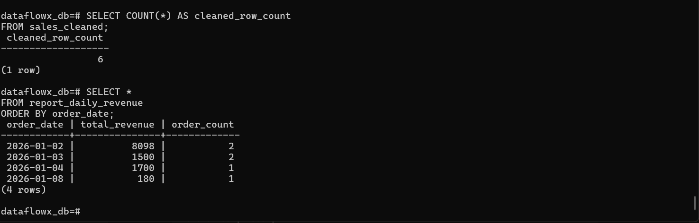
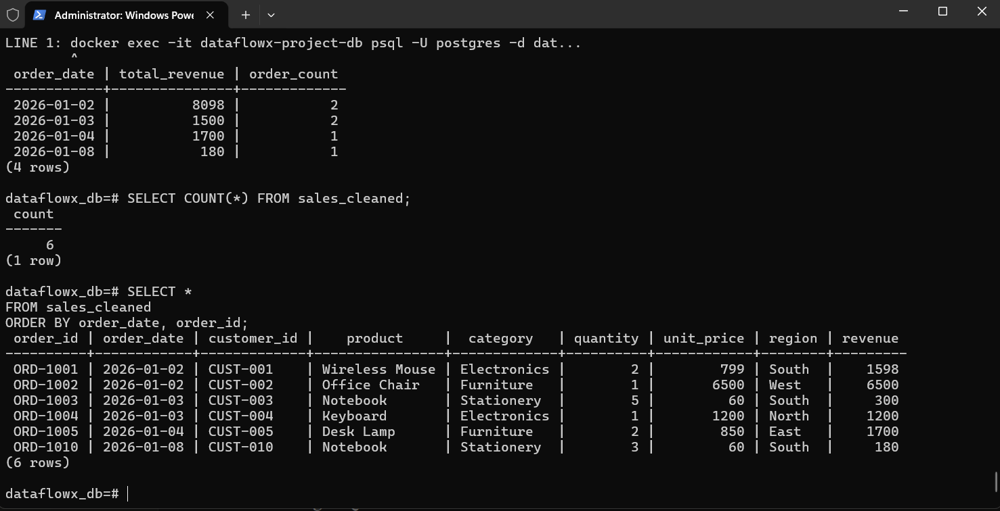
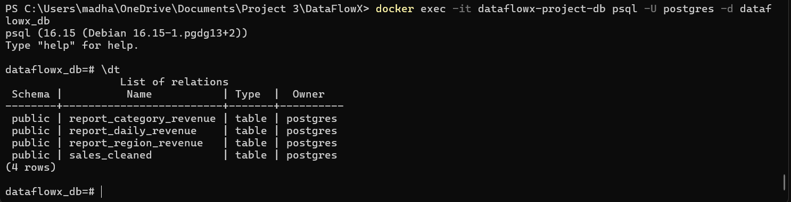
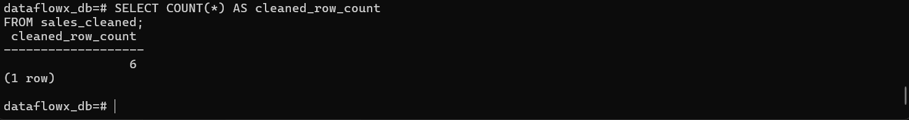

# DataFlowX Retail Sales ETL Pipeline

A containerized retail-sales ETL pipeline built with Apache Airflow, Python, Pandas, PostgreSQL, and Docker.

The pipeline extracts raw sales data, cleans and validates it, loads it into PostgreSQL, and creates a daily revenue report.

## Pipeline Architecture

```text
Raw CSV
   |
   v
Extract
   |
   v
Transform
   |
   v
Validate
   |
   v
Load into PostgreSQL
   |
   v
Daily Revenue Reporting
```

## Airflow DAG

The Airflow DAG is named:

```text
dataflowx_etl
```

The workflow contains five tasks:

```text
extract
   |
transform
   |
validate
   |
load
   |
reporting
```

## Technology Stack

- Apache Airflow for workflow orchestration.
- Python and Pandas for data processing.
- PostgreSQL for data storage.
- Docker and Docker Compose for containerized execution.
- SQL for reporting and data validation.
- Pytest for automated testing.

## Project Structure

```text
dataflowx-project/
├── config/
├── dags/
│   ├── dataflowx_etl_dag.py
│   ├── extract.py
│   ├── transform.py
│   ├── validate.py
│   ├── load.py
│   ├── reporting.py
│   └── sql/
│       └── reports.sql
├── data/
│   ├── raw/
│   │   └── retail_sales.csv
│   └── processed/
│       └── retail_sales_cleaned.csv
├── docker/
│   └── Dockerfile
├── scripts/
├── sql/
│   ├── init.sql
│   └── reports.sql
├── tests/
│   └── test_transform.py
├── docker-compose.yaml
├── requirements.txt
└── README.md
```

## Data Flow

### Extract

Reads the raw retail-sales CSV file from:

```text
data/raw/retail_sales.csv
```

### Transform

Cleans and prepares the data by:

- Removing duplicate orders.
- Standardizing column names.
- Converting dates into a consistent format.
- Calculating revenue.
- Writing the cleaned file to:

```text
data/processed/retail_sales_cleaned.csv
```

### Validate

Checks that:

- Order IDs are unique.
- Order dates are valid.
- Quantity values are positive.
- Unit prices are positive.
- Region values are not empty.
- Revenue values are valid.

### Load

Loads the cleaned data into the PostgreSQL table:

```text
sales_cleaned
```

### Reporting

Creates the daily revenue table:

```text
report_daily_revenue
```

The report contains:

- `order_date`
- `total_revenue`
- `order_count`

## Database Tables

The pipeline creates the following tables:

```text
sales_cleaned
report_daily_revenue
```

## Running the Project

### Start the containers

From the project root, run:

```powershell
docker compose up -d
```

Check running containers:

```powershell
docker ps
```

### Open Airflow

Open the following address in your browser:

```text
http://localhost:8080
```

Enable and trigger the DAG:

```text
dataflowx_etl
```

The expected task sequence is:

```text
extract → transform → validate → load → reporting
```

## PostgreSQL Verification

Connect to the database:

```powershell
docker exec -it dataflowx-project-db psql -U postgres -d dataflowx_db
```

List the tables:

```sql
\dt
```

Check the cleaned row count:

```sql
SELECT COUNT(*) AS cleaned_row_count
FROM sales_cleaned;
```

Check for duplicate order IDs:

```sql
SELECT order_id, COUNT(*)
FROM sales_cleaned
GROUP BY order_id
HAVING COUNT(*) > 1;
```

No rows should be returned.

View the daily revenue report:

```sql
SELECT *
FROM report_daily_revenue
ORDER BY order_date;
```

Exit PostgreSQL:

```sql
\q
```

## Validation Result

The duplicate-order validation passed with no duplicate `order_id` values found.

The daily revenue report was generated successfully with the following results:

| Order date | Total revenue | Order count |
|---|---:|---:|
| 2026-01-02 | 8098 | 2 |
| 2026-01-03 | 1500 | 2 |
| 2026-01-04 | 1700 | 1 |
| 2026-01-08 | 180 | 1 |

## Testing

Run the tests with:

```powershell
pytest
```

The test suite checks the transformation logic and data-processing behavior.

## Evidence

Project evidence includes:

- Airflow Graph view showing all five tasks completed successfully.
- PostgreSQL table listing using `\dt`.
- Cleaned sales row-count query.
- Daily revenue report query.
- Project structure.
- This README file.

## Security Notes

Environment-specific credentials are stored in environment variables or `.env` files.

Do not commit real passwords, secrets, or private credentials to GitHub.

The `.env` file should remain excluded through `.gitignore`.

## Future Improvements

Possible future improvements include:

- Adding automated data-quality alerts.
- Adding email or Slack notifications for failed tasks.
- Adding incremental loading.
- Adding a dashboard using Power BI or Streamlit.
- Adding CI/CD with GitHub Actions.
- Adding more unit and integration tests.
- Deploying the pipeline to a cloud platform.

## Pipeline Evidence

### Airflow DAG Success



### PostgreSQL Tables



### Cleaned Row Count



### Daily Revenue Report



### Project Structure


### Cleaned Sales Data



### README Preview

